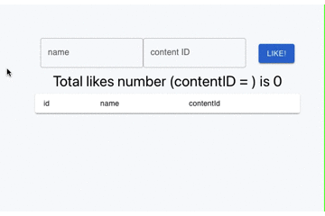

<div align="center">
  <a href="https://github.com/badmintoncryer/liketion">
    
  </a>
</div>

<h2 align="center">
  liketion - Simple container-based "like button" back-end
</h2>

[](https://open.vscode.dev/badmintoncryer/liketion)

[](https://github.com/badmintoncryer/liketion/issues)


[ English | [日本語版](README-ja.md) ]

liketion provides a simple container-based back-end for the "like button".
If you want to add a like function to your blog, page or other content,
you can set up a liketion server to manage likes via a REST API.

<div align="center">
  <a href="https://github.com/badmintoncryer/liketion">
    
  </a>
</div>

# Table of Contents

- [Table of Contents](#table-of-contents)
- [Installation](#installation)
  - [Environment](#environment)
  - [Build a docker image](#build-a-docker-image)
  - [docker compose](#docker-compose)
  - [post like example](#post-like-example)
  - [get likes example](#get-likes-example)
- [QuickStart](#quickstart)
  - [Configuration](#configuration)
    - [port](#port)
    - [rootPath](#rootpath)
  - [Running liketion](#running-liketion)
  - [sample application](#sample-application)
- [Integration](#integration)
  - [postLike](#postlike)
    - [endpoint](#endpoint)
    - [request body parameter](#request-body-parameter)
    - [return](#return)
    - [example](#example)
  - [getLikes](#getlikes)
    - [endpoint](#endpoint-1)
    - [return](#return-1)
      - [like](#like)
    - [example](#example-1)
  - [deleteLike](#deletelike)
    - [endpoint](#endpoint-2)
    - [Request body parameter](#request-body-parameter-1)
    - [return](#return-2)
    - [example](#example-2)
- [Integration with AWS Authenticated ALB and ECS](#integration-with-aws-authenticated-alb-and-ecs)
  - [Usage](#usage)
    - [examples](#examples)
      - [example1](#example1)
      - [example2](#example2)
      - [example3](#example3)

# Installation

## Environment

```shell
$ docker -v
Docker version 20.10.10, build b485636
```

## Build a docker image

You can get a Docker image by running

```shell
git clone https://github.com/badmintoncryer/liketion.git
cd liketion
docker build . -t liketion
```

or you can pull the image from dockerhub

```shell
docker pull nixiemintonprivate/liketion:latest
```

And you can use the following command to spawn the Docker container.
At this time, set the /path/to/db to the appropriate one.

```shell
docker run -d --rm --name liketion -p 127.0.0.1:3000:3000 -v /path/to/db:/usr/src/app/db -v /usr/src/node_modules liketion
```

## docker compose

If you want to get up and running quickly, you can also run the following command using docker compose.

```shell
git clone https://github.com/badmintoncryer/liketion.git
cd liketion
docker compose up
```

## post like example

```shell
curl -X POST -H "Content-Type: application/json" -d '{"name": "user name"}' http://localhost:3000/root_path/unique_id
```

## get likes example

```shell
curl http://loaclhost:3000/root_path/unique_id
```

# QuickStart

## Configuration

Various settings can be described in /config/settings.yaml

### port

Specifies the port number to listen on.

### rootPath

Specify a path relative to the root domain to listen.
For example, to listen at <https://example.com/liketion>, specify `rootPath: '/liketion'`.

Note that the path should not end with a '/'.

## Running liketion

To run liketion, simply execute

```shell
docker compose up
```

or

```shell
docker build . -t liketion
docker run -d --rm --name liketion -p 127.0.0.1:3000:3000 -v /path/to/db:/usr/src/app/db -v /usr/src/node_modules liketion
```

or

```shell
yarn dev
```

## sample application

With the liketion container running on http://localhost:3000, you can run sample apps for verification.

```shell
$ cd ./sample/sample-react-app
$ yarn
$ PORT=2345 yarn start
```

Accessing the http://localhost:2345 allows you to access a sample application and register a 'like' to liketion.

<div align="center">
  <a href="https://github.com/badmintoncryer/liketion">
    
  </a>
</div>

# Integration

## postLike

API to register a like. Registration in the DB as a pair of unique IDs and names. For example, it is assumed that part of the URL of the blog page is used for the ID.

### endpoint

```shell
POST https://example.com/{ROOT_PATH}/${id}
```

### request body parameter

| key  | value    |
| ---- | -------- |
| name | [string] |

### return

| key       | value                        | description                                                                                          |
| --------- | ---------------------------- | ---------------------------------------------------------------------------------------------------- |
| status    | "OK" or "Already Registered" | If a registration with the same id and name has already been made, "Already Registered" is returned. |
| contentId | id [string]                  | Path parameters (id) when carrying out a POST request.                                               |
| name      | [string]                     | Request body (name) when POST request is carried out.                                                |

### example

```shell
$ POST https://example.com/root_path/page_１ {"name": "Taro"}
{
    "status": "OK",
    "contentId": "page_1",
    "name": "Taro"
}

// Execute the same request again.
$ POST https://example.com/root_path/page_１ {"name": "Taro"}
{
    "status": "Already Registered",
    "contentId": "hoge",
    "name": "taro"
}

```

## getLikes

API to get the list of likes associated with a unique ID as an array.

### endpoint

```shell
GET https://example.com/{ROOT_PATH}/${id}
```

### return

| key    | value         | description                                                |
| ------ | ------------- | ---------------------------------------------------------- |
| status | "OK"          |                                                            |
| likes  | array of like | Array of likes, with details of the likes described below. |

#### like

| key       | value    | description                                            |
| --------- | -------- | ------------------------------------------------------ |
| id        | [number] | Primary key value.                                     |
| contentId | [string] | Path parameters (id) when carrying out a POST request. |
| name      | [string] | Name of the user who made the like                     |

### example

```shell
$ GET https://example.com/root_path/page_１
{
  "status": "OK",
  "likes":[
    {
      "id":2,
      "contentId":"page_1",
      "name":"Taro"
    },
    {
      "id":3,
      "contentId":"page_1",
      "name":"Jiro"
    }
  ]
}
```

## deleteLike

API for deleting Likes associated with unique ID.

### endpoint

```shell
GET https://example.com/{ROOT_PATH}/${id}
```

### Request body parameter

| key  | value    | description                                                                                                                               |
| ---- | -------- | ----------------------------------------------------------------------------------------------------------------------------------------- |
| name | [string] | Specifies the username of the "like" to be deleted; if name is not passed as a parameter, all "likes" associated with the id are deleted. |

### return

| key       | value                    | description                                                          |
| --------- | ------------------------ | -------------------------------------------------------------------- |
| status    | "OK" or "Not Registered" | If the deletion target does not exist, "Not Registered" is returned. |
| contentId | [string]                 | Unique ID.(as passed in the path parameter)                          |
| name      | [string]                 | Parameters of the request body passed as name                        |

### example

```shell
# Delete Taro's Like on page_1
$ DELETE https://example.com/root_path/page_１ {"name": "Taro"}
{
  "status": "OK",
  "contentId": "page_1",
  "name": "Taro"
}
```

```shell
# Delete all page_1 likes.
$ DELETE https://example.com/root_path/page_１
{
  "status": "OK",
  "contentId": "page_1",
}
```

# Integration with AWS Authenticated ALB and ECS

As an example of a use case, a liketion container can be deployed on the back end of an authenticated Application Load Balancer (ALB) with Elastic Container Service (ECS).
By linking ALB and various IdPs with OIDC, only users who have passed authentication can access ECS containers.

<div align="center">
    
</div>

[ALB adds a user information header to HTTP accesses to the container by authenticated users.](https://docs.aws.amazon.com/elasticloadbalancing/latest/application/listener-authenticate-users.html) The user name, email address, etc. can be extracted from this header information and used as a substitute for the name in postLike.

## Usage

Execute postLike without adding a request body, specifying only the path parameter.

The liketion extracts the name and email fields from the "x-amzn-oidc-data" added by the ALB and registers these values in the DB as user names.

If both name and email are defined in the x-amzn-oidc-data, name is used for registration in the DB. If neither is defined, the name parameter in the request body is used.

The name parameter can also be specified in the request body, but it is overridden by the x-amzn-oidc-data value.

### examples

#### example1

```shell
$ POST https://example.com/root_path/page_１ (without request body)

The payload of x-amzn-oidc-data is
{
  sub: '3456789-abcdefg',
  email_verified: 'false',
  name: 'username'
  email: 'test@mail_address.com',
  exp: 1651818337,
  iss: 'https://cognito-idp.ap-northeast-1.amazonaws.com/ap-northeast-1_aaaaaaaaa'
}

return is
{
    "status": "OK",
    "contentId": "page_1",
    "name": "username"
}

```

#### example2

```shell
$ POST https://example.com/root_path/page_１ (without request body)

The payload of x-amzn-oidc-data is
{
  sub: '3456789-abcdefg',
  email_verified: 'false',
  email: 'test@mail_address.com',
  exp: 1651818337,
  iss: 'https://cognito-idp.ap-northeast-1.amazonaws.com/ap-northeast-1_aaaaaaaaa'
}

return is
{
    "status": "OK",
    "contentId": "page_1",
    "name": "test@mail_address.com"
}
```

#### example3

```shell
$ POST https://example.com/root_path/page_１ {"name": "Taro"}

The payload of x-amzn-oidc-data is
{
  sub: '3456789-abcdefg',
  email_verified: 'false',
  email: 'test@mail_address.com',
  exp: 1651818337,
  iss: 'https://cognito-idp.ap-northeast-1.amazonaws.com/ap-northeast-1_aaaaaaaaa'
}

return is
{
    "status": "OK",
    "contentId": "page_1",
    "name": "test@mail_address.com"
}
# Even if name is specified in the request body,
# it is overwritten and registered because the email field exists in the x-amzn-oidc-data header.
```
